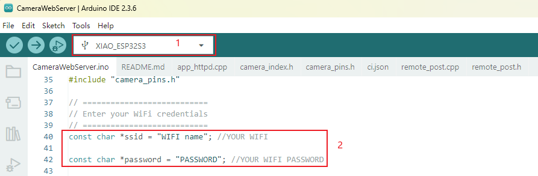

# Xverse VRFace Tracking

<a href="./LICENSE">
        </a>


[
  
](http://xverse.cn/)


# Introduction

 Xverse VRFace Tracking is a lower face tracking project developed by XVERSE Technology Inc. (Shenzhen, China), aiming to provide real-time face tracking with any VR headset in different lighting. Currently, our face tracking project is implemented based on VRface and VRCFaceTracking，leveraging the simplicity and convenience of VRCFT.

We will actively release new features in this repo, please stay tuned. Some future updates will contain:
- [ ] Enhance Facial Expression Prediction
- [ ] Inplement Tongue Expression Prediction


  
  


# Getting Started

You can make your own camera hardware in [Hardware](#hardware) or contact us via email jiangchanghao@xverse.cn to purchase finished products. Below are visuals of the camera’s appearance, installation, and how it looks in use.


 
 
 


## System Requirements
- Windows 10 or 11
- Python 3.10 or higher
- VRface and VRCFaceTracking


## Software Install 


 1.Install [**ardunio**](https://www.arduino.cc/en/software/). Connect ESP32S3 to your PC with a micro-USB/mini-USB/USB type-c cable. Open [**CameraWebServer.ino**](https://github.com/xverse-engine/XVRFaceTracking/blob/main/CameraWebServer/CameraWebServer.ino)       in [**CameraWebServer**](https://github.com/xverse-engine/XVRFaceTracking/blob/main/CameraWebServer/) via ardunio. Change board type to XIAO_ESP32S3 and fill your WiFi network name and password.

 


 Open [**CameraWebServer.ino**](https://github.com/xverse-engine/XVRFaceTracking/blob/main/CameraWebServer/remote_post.cpp)       in [**CameraWebServer**](https://github.com/xverse-engine/XVRFaceTracking/blob/main/CameraWebServer/). Fill your PC IP, verify and upload.

 You can run 'ipconfig' in terminal to know your PC IP.
 


 
 Upload the    [**CameraWebServer.ino**](https://github.com/xverse-engine/XVRFaceTracking/blob/main/CameraWebServer/CameraWebServer.ino)       in [**CameraWebServer**](https://github.com/xverse-engine/XVRFaceTracking/blob/main/CameraWebServer/) to the ESP32S3 via Arduino. If the above steps are completed successfully, the ESP32S3 will be able to connect to your Wi-Fi network. And the ESP32S3's IP address can be located via your local Wi-Fi. Or you may run build and run the docker in [**backend**](https://github.com/jiangchh1/VRface_Test/tree/main/backend), which could be used for accuracy evaluation of deep learning models.

 The file structure of [**backend**](https://github.com/jiangchh1/VRface_Test/tree/main/backend) is as below:

```
├── backend/                    # Backend service core
│   ├── Dockerfile             # Containerization config
│   ├── logexp.ipynb           # Experimental log analysis notebook
│   ├── prestart.sh            # Service pre-launch script
│   ├── README.md              # Backend-specific documentation
│   │
│   └── app/                   # Main application module
│       ├── main.py            # Service entry point
│       ├── __init__.py        # Python package initialization
│       │
│       ├── infer/             # Inference modules
│       │   ├── babbleonnx_landmark.py    # ONNX model inference
│       │   ├── babble_processor.py       # Data processor
│       │   ├── mediapipe_landmark.py     # MediaPipe implementation
│       │   ├── one_euro_filter.py        # Motion filter algorithm
│       │   ├── osc_calibrate_filter.py   # OSC calibration
│       │   ├── tab.py                   # Data table processor
│       │   └── xverse_landmark.py       # Custom landmark detection
│       │
│       ├── internal/          # Internal utilities
│       │   ├── camera.py      # Camera interface
│       │   ├── common.py      # Common functions
│       │   ├── config.py      # Configuration loader
│       │   ├── deviceTask.py  # Device task manager
│       │   ├── image_transforms.py  # Image transformations
│       │   ├── misc_utils.py  # Miscellaneous utilities
│       │   └── osc.py        # OSC protocol implementation
│       │
│       ├── Models/            # Model storage
│       │   ├── face_landmarker.task  # MediaPipe model file
│       │   └── 3MEFFB0E7MSE/         # Custom model
│       │       └── onnx/             
│       │           └── vrface0318.onnx      # ONNX format models
│       └── routers/           # API endpoints
│           ├── faceCapture.py # Facial capture API
│           └── __init__.py    # Router initialization
```
The file structure of [**CameraWebServer**](https://github.com/jiangchh1/VRface_Test/tree/main/backend) is as below:
```
├── CameraWebServer/            # Camera web service
│   ├── app_httpd.cpp          # HTTP server implementation
│   ├── CameraWebServer.ino    # Arduino main sketch
│   ├── camera_index.h         # Web interface template
│   ├── camera_pins.h          # Hardware pin definitions
│   ├── ci.json               # CI configuration
│   ├── partitions.csv        # ESP32 partition table
│   ├── README.md             # README doc
│   ├── remote_post.cpp       # Remote communication module
│   └── remote_post.h         # Communication header
```


 
 The picture below shows the uploading process in ardunio.


  


 2.Install [**VRCFaceTracking**](https://github.com/benaclejames/VRCFaceTracking). Drop the VRCFaceTracking.Xverse.dll and XverseConfig.json into AppData\Roaming\VRCFaceTracking\CustomLibs. If you can't find this path, you can use [**Everything**](https://www.voidtools.com/zh-cn/) for search. If this folder does not exist you can create it, VRCFaceTracking will create it on launch.


  


 3.Run [**XverseVRfaceMouthDetectionUI.py**](https://github.com/jiangchh1/VRface_Test/blob/main/XverseVRfaceMouthDetectionUI.py). Stream Url is 'http://'+ your ESP32S3 IP +':81/stream'. ONNX Path refers to the file path of the ONNX model on your computer. Download ONNX file [**here**](https://github.com/xverse-engine/XVRFaceTracking/blob/main/backend/app/Models/3MEFFB0E7MSE/onnx/vrface0318.onnx)


  


 


 4.Open VRCFaceTracking and VRChat. In VRChat, select an avatar that supports VRCFT and enable OCT. If you are unable to animate the avatar's facial expressions, ensure that ports 8888 and 9000 on your local machine are not blocked or already in use.


  


## Hardware


The photograph below documents the finalized camera installation.

 

You will need [**Xiao_ESP32S3**](https://wiki.seeedstudio.com/cn/xiao_esp32s3_getting_started/)(It has compact size with both wireless and wired support and no need for additional  antennas) and OV2640 with a viewing angle of 160 degrees. These two components, when powered through the Type-C port, can stream the signal to the computer. Alternative device for Xiao_ESP32S3 is Freenove ESP 32-S3 WROOM, which is larger and  more expensive than Xiao_ESP32S3, and lacks support for an external antenna. Alternative cameras with a narrower viewing angle may reduce recognition accuracy and demand higher lighting conditions. 


  

  
Optional components: 3.7V battery, 5mm White Through Hole LED. Either 3.3V or 5V can be used to power the LEDs, however the resistors used will be different. 5V can only be used when powered over USB while 3.3V can be used with both USB and battery power. For 3.3V power: Use 82-ohm resistors in series with the LEDs. For 5V power: Use 160-ohm resistors in series with the LEDs. Connect the GND pin on the ESP32 to the cathode (short leg) of the LED. Add an appropriate resistor (82 ohms for 3.3V, 160 ohms for 5V) in series with the anode (long leg) of the LED. Do not connect LEDs directly to the ESP32 pins without a resistor, as it may damage the LEDs or the microcontroller. Refer to the following figure for LED connection.


  


If you want to connect a battery to the Xiao, we recommend that you purchase a qualified 3.7V rechargeable lithium battery. When soldering the battery, be careful to distinguish the positive and negative terminals. The negative terminal of the battery should be on the side closest to the USB port (BAT-), and the positive terminal of the battery should be on the side away from the USB port (BAT+). Refer to the following two figures for battery connection.


  


  


Print the model inside '3D_model'. Currently, our 3D model is provided for the Quest 3. If you require hardware-related assistance or wish to purchase finished products, please contact us via email jiangchanghao@xverse.cn. The picture below shows the hardware we assembled.


This GIF below illustrates the standard installation procedure for our hardware.


